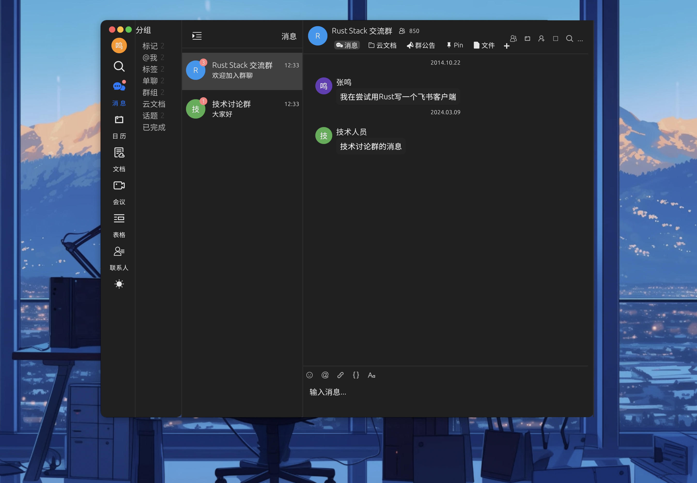
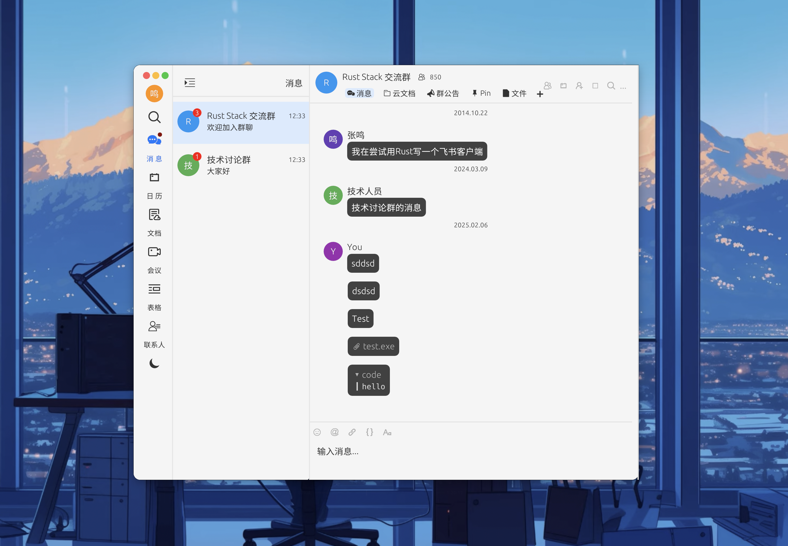

# Feishu-Rust-Client 

[](https://www.rust-lang.org/)
[](https://bevyengine.org/)
[](LICENSE)

Rust Lark GUI 


### 🖥️ GUI

### Theme

| DarkTheme | LightTheme |
|----------|----------|
|  |  |

```mermaid
graph TD
    A[Root Window] --> B[Left Navbar]
    A --> C[Top Panel]
    A --> D[Main Chat Area]
    A --> E[Bottom Input]
    B --> F[Workspace Selector]
    B --> G[Chat Categories]
    C --> H[Window Controls]
    C --> I[Search Bar]
    D --> J[Message List]
    D --> K[Message Bubbles]
    E --> L[Rich Text Editor]
    E --> M[Attachment Panel]
   

